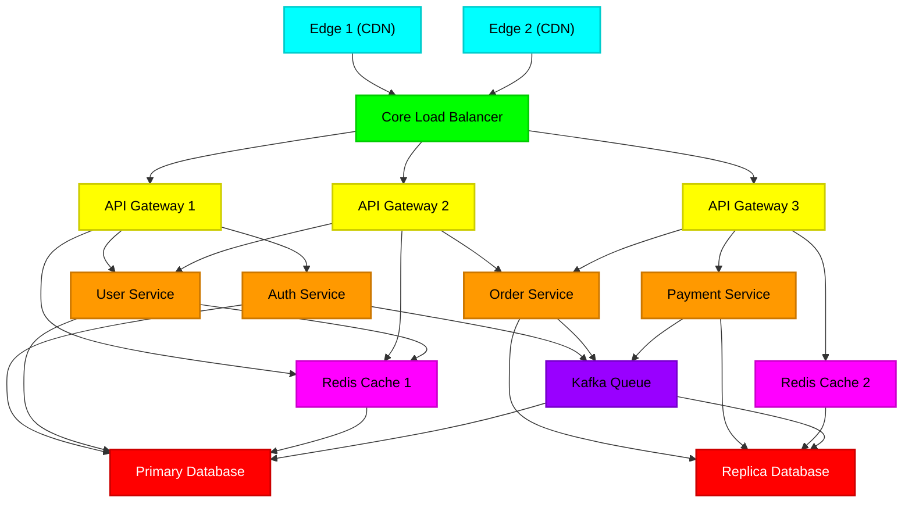

# 🪐 BLACKOUT: Cyberpunk Cascading Failure SRE Simulator

<p align="center">
  
</p>

**BLACKOUT** is an immersive, high-tension Site Reliability Engineering (SRE) playground and interactive microservice outage simulator. Built with a premium, CRT-scanline cyberpunk aesthetic, it allows developers to model, visualize, and inject chaos into a regional system-dependency map in real time. 

> [!NOTE]
> This is a **pure frontend sandbox simulation**. It runs entirely client-side inside the browser. It executes **no** destructive terminal commands or system-level scripts that could impact your physical computer or hardware.

---

## ⚡ Key Features

* **Visual Infrastructure Map**: A 15-node regional system grid spanning `GLOBAL`, `US-EAST`, `US-WEST`, and `EU-WEST` regions, mapping edges, load balancers, api-gateways, compute servers, cache servers, Kafka queues, and databases.
* **Deterministic State-Machine**: Systems organically shift state based on live queue load:
  $$\text{Healthy} \xrightarrow{\text{Load } \ge 75\%} \text{Stress} \xrightarrow{\text{Load } \ge 92\%} \text{Degraded} \xrightarrow{\text{Compounding Chance}} \text{Failure}$$
* **Stress Propagation Engine**: Simulates realistic upstream database outage pressure on servers, cache-miss storms, and automatic load redistribution/failover across active redundant compute clusters.
* **AI Telemetry & operator logs (ORION-9)**: Live telemetry commentary `/api/commentary` and full post-mortem generator `/api/analyze` leveraging **Ollama (local Gemma2/Phi4)**, **Google Gemini**, or **OpenAI** API endpoints with a robust, offline procedural fallback script.
* **Chaos Scenario Injection**: Trigger system events from the operator terminal:
  * *Traffic Surge*: Satures CDN edges and routing pipelines.
  * *Database Failure*: Catastrophically drops core replicas, starting cascade chains.
  * *Domino Outage*: Initiates continuous, compounding outages across randomly connected adjacent dependencies.

---

## 🏗 System Topology Architecture

The simulation simulates an enterprise-grade high-availability network topology:



---

## 🚀 Quick Start

### 1. Clone & Install Dependencies
Ensure you have Node.js (version 18+) installed:
```bash
npm install
```

### 2. Configure Environment Keys (Optional)
Create a `.env.local` file at the root of the project to enable advanced AI SRE operator intelligence:
```env
# Cloud AI Credentials
GEMINI_API_KEY=your_google_gemini_api_key_here
OPENAI_API_KEY=your_openai_api_key_here
```
*(If no API keys are provided, the simulator seamlessly uses your local **Ollama** engine at `http://localhost:11434` or falls back to an atmospheric offline procedural generation script!)*

### 3. Run Development Server
```bash
npm run dev
```
Open **[http://localhost:3000](http://localhost:3000)** or **[http://localhost:3000/simulator](http://localhost:3000/simulator)** to operate the grid.

---

## 🛠 Developer Tuning: Mitigating Windows CPU/Disk Spikes

When running Next.js development servers on Windows, local antivirus tools (such as **Windows Defender**) can conflict with the compiler's rapid file caching, causing `100% CPU/Disk` spikes. To resolve this:

1. **Add a Defender Exclusion**:
   * Open **Windows Security** > **Virus & threat protection settings** > **Exclusions** (Add or remove exclusions).
   * Click **Add an exclusion** > **Folder**, and select this project directory.
2. **Exclude Build Artifiacts**:
   * In `tsconfig.json`, the generated graphify folders and next caches are excluded to avoid background type-scanning routines:
     ```json
     "exclude": [
       "node_modules",
       "graphify-out",
       ".next"
     ]
     ```

---

## 📂 Codebase Navigation & Architecture

For a deep dive into the simulation architecture, check out the documentation:
* 📄 **[Technical Requirements Document](Docs/Technical%20Requirements%20Document%20(TRD).md)**
* 📄 **[Backend Schema](Docs/Backend%20Schema.md)**
