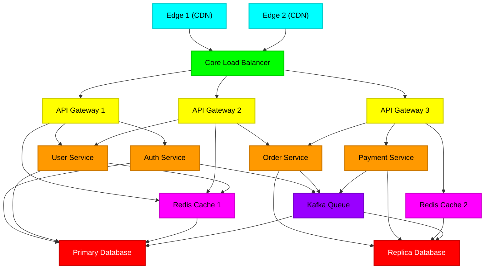

# 🪐 BLACKOUT: Cyberpunk Cascading Failure SRE Simulator

<p align="center">
  
</p>

**BLACKOUT** is an immersive, high-tension Site Reliability Engineering (SRE) playground and interactive microservice outage simulator. Built with a premium, CRT-scanline cyberpunk aesthetic, it allows developers to model, visualize, and inject chaos into a regional system-dependency map in real time. 

> [!NOTE]
> BLACKOUT V1 is a **full-stack application**. It features a **Next.js** interactive frontend, a **FastAPI** simulation engine, a **Neo4j** graph database for storing architectures, and **Clerk** for user authentication and multi-tenant architecture scoping.
---

## ⚡ Key Features

* **Visual Infrastructure Map**: A 15-node regional system grid spanning `GLOBAL`, `US-EAST`, `US-WEST`, and `EU-WEST` regions. Create and save your own custom architectures!
* **Deterministic State-Machine**: Systems organically shift state based on live queue load:
  $$\text{Healthy} \xrightarrow{\text{Load } \ge 75\%} \text{Stress} \xrightarrow{\text{Load } \ge 92\%} \text{Degraded} \xrightarrow{\text{Compounding Chance}} \text{Failure}$$
* **Neo4j Graph Backend**: Architectures and simulation topologies are stored, traced, and analyzed using Neo4j Cypher queries for explosive blast-radius calculation.
* **Multi-Tenant Dashboard**: Sign in with Clerk to save architectures, view simulation history, and track system resilience.
* **Chaos Scenario Injection**: Trigger system events from the operator terminal:
  * *Traffic Surge*: Satures CDN edges and routing pipelines.
  * *Database Failure*: Catastrophically drops core replicas, starting cascade chains.
  * *Targeted Faults*: Inject latency spikes, packet loss, or DB saturation onto specific nodes.

---

## 🏗 System Topology Architecture

The simulation simulates an enterprise-grade high-availability network topology:



---

## 🚀 Quick Start

### 1. Requirements
Ensure you have the following installed:
* Node.js (version 18+)
* Python (version 3.10+)
* Neo4j Database (Local or AuraDB)

### 2. Configure Environment Keys
Create a `.env.local` file at the root of the project to enable Clerk Auth and AI SRE operator intelligence:
```env
NEXT_PUBLIC_CLERK_PUBLISHABLE_KEY=pk_test_...
CLERK_SECRET_KEY=sk_test_...

# Neo4j Graph Database
NEO4J_URI=bolt://localhost:7687
NEO4J_USER=neo4j
NEO4J_PASSWORD=password
```

### 3. Start Backend Services
```bash
# In a new terminal, activate virtual environment and start FastAPI
cd backend
python -m venv venv
source venv/bin/activate  # or `venv\Scripts\activate` on Windows
pip install -r requirements.txt
uvicorn backend.main:app --reload
```

### 4. Run Frontend Server
```bash
# In your main terminal
npm install
npm run dev
```
Open **[http://localhost:3000](http://localhost:3000)** or **[http://localhost:3000/simulator](http://localhost:3000/simulator)** to sign in and operate the grid.

---

## 🛠 Developer Tuning: Mitigating Windows CPU/Disk Spikes

When running Next.js development servers on Windows, local antivirus tools (such as **Windows Defender**) can conflict with the compiler's rapid file caching, causing `100% CPU/Disk` spikes. To resolve this:

1. **Add a Defender Exclusion**:
   * Open **Windows Security** > **Virus & threat protection settings** > **Exclusions** (Add or remove exclusions).
   * Click **Add an exclusion** > **Folder**, and select this project directory.
2. **Exclude Build Artifiacts**:
   * In `tsconfig.json`, the generated graphify folders and next caches are excluded to avoid background type-scanning routines:
     ```json
     "exclude": [
       "node_modules",
       "graphify-out",
       ".next"
     ]
     ```

---

## 📂 Codebase Navigation & Architecture

For a deep dive into the simulation architecture, check out the documentation:
* 📄 **[Technical Requirements Document](Docs/Technical%20Requirements%20Document%20(TRD).md)**
* 📄 **[Backend Schema](Docs/Backend%20Schema.md)**
