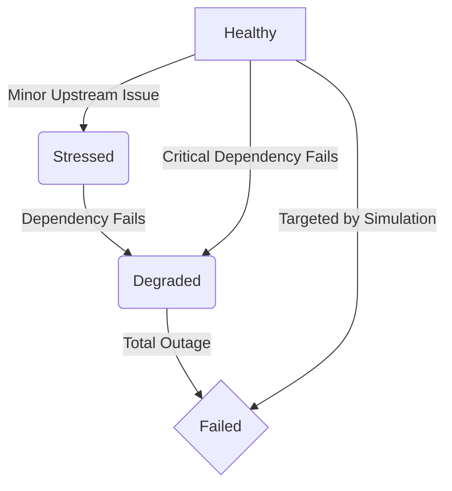

During a simulation run, the BLACKOUT engine continuously updates the "State" of every node in your graph. A state represents the node's current health and operational capacity.

There are four primary states in the BLACKOUT state machine:

## 1. Healthy
- **Meaning:** The node is operating within normal parameters. It is successfully processing requests and communicating with its dependencies.
- **Visual Appearance:** Rendered with a solid green border and a green status indicator in the dashboard.
- **Transition Conditions:** All nodes begin the simulation in the `HEALTHY` state. A node remains `HEALTHY` as long as its upstream dependencies are also `HEALTHY`.

## 2. Stressed
- **Meaning:** The node is experiencing increased load, minor latency, or elevated error rates, but is generally still functioning. It has not breached critical timeout thresholds.
- **Visual Appearance:** Rendered with an amber/yellow warning indicator.
- **Transition Conditions:** A node transitions to `STRESSED` if:
  1. It is the explicit target of a `LATENCY_SPIKE` scenario.
  2. One of its direct dependencies transitions to `DEGRADED`.
  3. The AI engine predicts a minor retry storm accumulating on its inbound edges.

## 3. Degraded
- **Meaning:** The node is severely impaired. It is rejecting a large portion of traffic, throwing HTTP 5xx errors, or experiencing massive timeouts. Some functionality may still work, but the primary purpose is failing.
- **Visual Appearance:** Rendered in orange.
- **Transition Conditions:** A node becomes `DEGRADED` when:
  1. It is the target of a `CONNECTION_DROP` scenario.
  2. A direct dependency transitions to `FAILED`.
  3. A frontend application loses access to a core backend service.

## 4. Failed
- **Meaning:** Total operational collapse. The node is completely unresponsive. It accepts no connections and returns no data.
- **Visual Appearance:** Rendered with a red pulsing border and a critical error indicator.
- **Transition Conditions:** A node transitions to `FAILED` when:
  1. It is the explicit target of a `COMPLETE_OUTAGE` scenario.
  2. A critical path dependency transitions to `FAILED` and no fallback mechanism (like a cache) is present in the graph definition.

---

### State Transition Flow

The engine evaluates state transitions directionally (upstream). 

